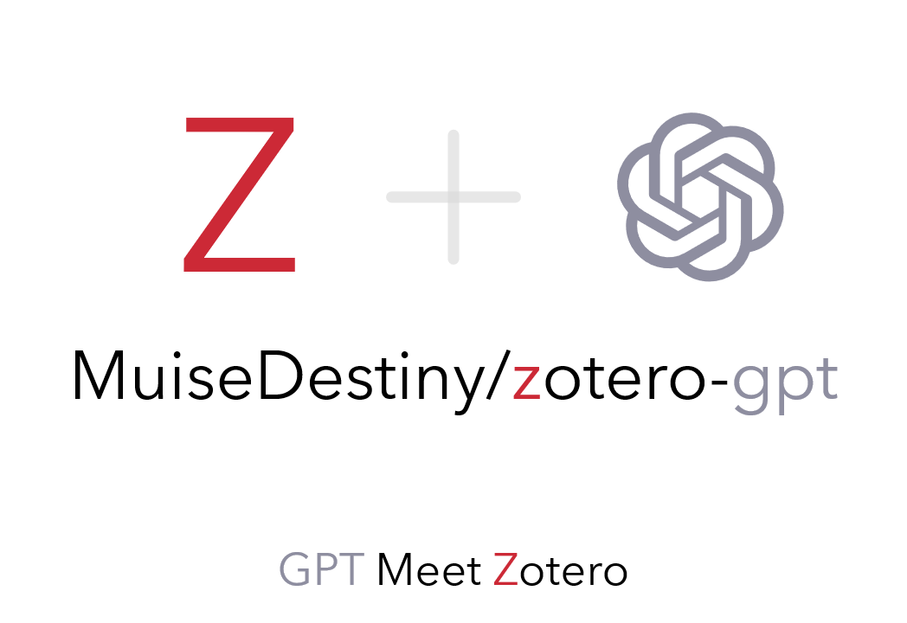

<div align="center">
  

# Zotero Assistant

An AI Assistant for Zotero

</div>

---

## 🚀 Main Features
Features about AI:  
- [x] 🔗 **Integrate with Zotero**: You can use the plugin to search and ask items in the library based on the selected text or the PDF file.
- [x] 🧠 Use LLMs to generate reply text: support OpenAI, DeepSeek and other compatible APIs
- [x] 🏷️ [Command tags](https://github.com/AND-Q/ZoteroAssistant#command-tags): **Click once** to accelerate your research.  
  - [x] 💬 Ask questions about current **PDF file** (full-text or selected text).
  - [x] 💬 Ask questions about **selected paper** (Abstract).
  - [x] 📝 **Summarize the selected paper** into several highly condensed sentences.
  - [x] 🔍 **Search items** in the library based on the selected text.
  - [x] ... ...
- [x] ⚙️ **Advanced settings for AI**: You can set api key, model name, api url, temperature.
- [x] 📚 **Integrate with Better Notes**: You can directly open this plugin when using Better Notes.

Features about UI:
- [x] 🎨 **Real-time markdown rendering** for reply text: Latex and mathjax are supported.
- [x] 🔍 **Zoom in and out** of the reply text or the size of the plugin window.
- [x] 🖱️ **Move the plugin window to any position** on the screen.
- [x] 📋 **Copy the reply text** to the clipboard.
- [x] ⚠️ Detailed **error message** will be displayed when the request fails.
- [x] 🔧 Compatible with **Zotero 6** and **Zotero 7+**.

## How to use
- [x] Build this project to generate a `.xpi` file:
```bash
npm install
npm run build
```
- [x] Install `.xpi` file in Zotero
- [x] Open Zotero Assistant (<kbd>Cmd</kbd> + <kbd>/</kbd> on Mac, <kbd>Ctrl</kbd> + <kbd>/</kbd> on Windows)
- [x] Set your API key via `/secretKey your_key` or `/api your_api_url`

### [2] Install the extension in Zotero
Open Zotero. In the top menu bar, click on `Tools > Add-ons`.
Click on the gear icon at the top right of the window. Click on `Install Add-on From File` and open the generated `.xpi` file in the build directory from the previous step.

### [3] Open/Exit Zotero GPT

|Action|Shortcut|
|--|--|
|Open||
|Exit|`ESC`|
|Multi-line editing| `Shift` + `Enter`|

### [4] Set up the API key


## Hi, Command Tag.
> 👻 Follow the steps below, and you will gain a new understanding of command tags.

|Step| Description | Supplementary Information |
|----|-------------|---------------------------|
|1   | Open Zotero GPT | Refer to [3] Open/Exit Zotero GPT |
|2   | Type `#Tag Name` and press `Enter` |  |
|3   | Input your prompt or code |  |
|4   | **R**un your tag | Press `Ctrl + R` |
|5   | **S**ave your tag | Press `Ctrl + S` |
|6   | Long press a command tag to access the editing interface |  |
|7   | Modify the tag's color, position, or trigger; remember to save with `Ctrl + S` |  |
|8   | Press `ESC` to exit the editing interface | Remember to save your changes with `Ctrl + S` before exiting |
|9   | Long press the right mouse button to delete a tag | Note: Build-in tags do not support deletion |

### How to run a command tag
> Trigger is an attribute of a command tag, as are color and position. Long press any label to view/modify its trigger word. It supports both plain text and JS regular expressions.


### How to write a code block

A simple example:
```
Summarize the following paragraph for me:

${Meet.Zotero.getPDFSelection()}
```

Here, the `Summarize the following paragraph for me:` represents plain text, while `${your code}` denotes a code snippet. The code snippet will be executed, and the text returned by the code snippet will replace the code snippet. Finally, the replaced text will be input to the AI model.

### How to navigate historical chats

> Press the up (↑) and down (↓) keys on the keyboard to navigate.


